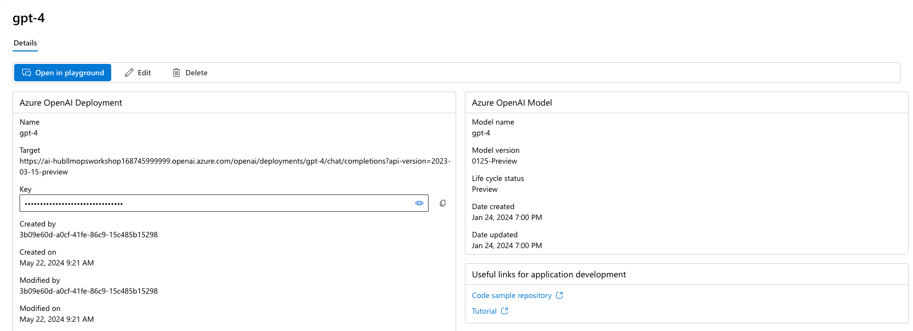
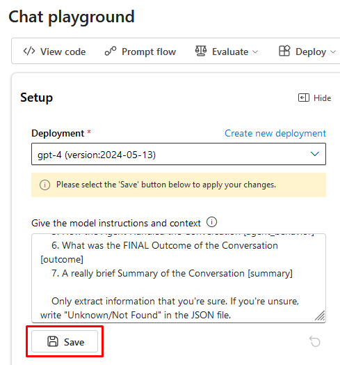
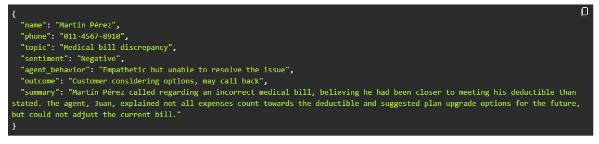

# Task 01 - Use the Azure AI Studio Playground

## Introduction

In an effort to evaluate the use of AI in their organization, Lamna Healthcare has identified the use case of employing large language models to help extract information, determine sentiment, and summarize the content of conversations between their customers and the company's customer support representatives. Historically, there has been significant negative feedback from customers about the quality of service provided by the customer support team. The company believes that by analyzing the content of these conversations using AI, they can save time on the manual review of conversation transcripts. This use case will serve as a preliminary test to determine the feasibility of using AI in their organization.

## Description

In this task, you will leverage the Azure AI Studio Playground and a Large Language Model to summarize and extract information from a transcript of a conversation between a customer and support representative. At this time, Lamna Healthcare is not looking for a programming-based solution, but rather a simple way to test the use of a Large Language Model for their use case. The goal is to determine if the model can accurately extract the required information from a conversation transcript.

The key tasks are as follows:

1. Use [Azure AI Studio](https://ai.azure.com) to create a project and AI Hub along with its underlying Azure resources.

2. Open the Azure AI Studio Playground to interact with the gpt-4 deployment.

3. In the Azure AI Studio Playground, author and set a system message that directs the LLM to extract the following information from a conversation transcript and output the result formatted as JSON. Having the output as JSON allows for the ease of integration of these results at a later time into other systems. The JSON should contain the following information (you may specify your choice of field names):
      - Customer Name
      - Customer Contact Phone
      - Main Topic of the Conversation
      - Customer Sentiment (Neutral, Positive, Negative)
      - How the Agent Handled the Conversation
      - What was the FINAL Outcome of the Conversation
      - A really brief Summary of the Conversation

4. Provide a sample transcript of a customer service conversation to the model and observe the output. Experiment with modifying the system prompt to obtain the desired results. Here is a sample transcript of a conversational exchange between a customer and the Lamna Heathcare customer service department, but feel free to provide your own during experimentation:

```text
Agent: Hello, welcome to Lamna Healthcare customer service. My name is Juan, how can I assist you?
Client: Hello, Juan. I'm calling because I'm having issues with my medical bill I just received few days ago. It's incorrect and it does not match the numbers I was presented before my medical procedure.
Agent: I'm very sorry for the inconvenience, sir. Could you please tell me your phone number and your full name?
Client: Yes, sure. My number is 011-4567-8910 and my name is Martín Pérez.
Agent: Thank you, Mr. Pérez. I'm going to check your plan, you deduction limits and current year transactions towards your deductions. One moment, please.
Client: Okay, thank you.
Agent: Mr. Pérez, I've reviewed your plan and I see that you have the Silver basic plan of $3,000 deductable. Is that correct?
Client: Yes, that's correct.
Agent: Well, I would like to inform you that you have not met your deductible yet and $2,800 of the procedure will be still be your responsability and that will meet your deductible for the year.
Client: What? How is that possible? I paid over $2,000 already towards my deductable this year, I should only be $1,000 away from reaching my deductible not $2,800. 
Agent: I understand, Mr. Pérez. But keep in mind that not all fees your pay to doctors and labs and medications count towards your deductible. 
Client: Well, but they didn't explain that to me when I contracted the plan. They told me that everything I pay from my pocket towards doctors, specialists, labs and medications will count towards my deductable. I feel cheated.
Agent: I apologize, Mr. Pérez. It was not our intention to deceive you. If you think the deductable is too high, I recommed changing the plan to Gold at the next renewal window and that will bring the deductable to $1,000 for the new year.
Client: And how much would that cost me?
Agent: The plan rates will come out in November, you can call us back then or check the new rates online at that time.
Client: Mmm, I don't know. Isn't there another option? Can't you reduce the amount I have to pay for this bill as I was not explained how the deductible work correctly?
Agent: I'm sorry, Mr. Pérez. I don't have the power to change the bill or your deductible under the current Silver plan.
Client: Well, let me think about it. Can I call later to confirm?
Agent: Of course, Mr. Pérez. You can call whenever you want. The number is the same one you dialed now. Is there anything else I can help you with?
Client: No, that's all. Thank you for your attention.
Agent: Thank you, Mr. Pérez. Have a good day. Goodbye.
```
## Success Criteria

* The system message, when used with the LLM, consistently results in the LLM returning accurate and properly formatted JSON based on the provided conversation transcript.

## Solution

<details markdown="block">
<summary>Expand this section to view the solution</summary>

##### 1) Use Azure AI Studio Playground

The Azure AI Studio Playground provides a simple and interactive user interface to test and experiment with deployed Azure AI Studio models.

1. In [Azure AI Studio](https://ai.azure.com), ensure you are in the project you created in the previous task, and select **Deployments** from the left-hand menu.

2. From the list of model deployments, select the model you deployed in the previous task.

3. On model screen, select the **Open in playground** button.

    

4. Copy the following prompt and paste it into the system message field of the playground:

    ```text
    You're an AI assistant that helps Lamna Healthcare Customer Service to extract valuable information from their conversations by creating JSON files for each conversation transcription you receive. You always try to extract and format as a JSON:
    1. Customer Name [name]
    2. Customer Contact Phone [phone]
    3. Main Topic of the Conversation [topic]
    4. Customer Sentiment (Neutral, Positive, Negative)[sentiment]
    5. How the Agent Handled the Conversation [agent_behavior]
    6. What was the FINAL Outcome of the Conversation [outcome]
    7. A really brief Summary of the Conversation [summary]

    Only extract information that you're sure. If you're unsure, write "Unknown/Not Found" in the JSON file.
    ```

5. After copying, select **Apply changes**, (if prompted start a new chat)

    

6. Copy following text and paste it into the chat session and press the send button:

```text
Agent: Hello, welcome to Lamna Healthcare customer service. My name is Juan, how can I assist you?
Client: Hello, Juan. I'm calling because I'm having issues with my medical bill I just received few days ago. It's incorrect and it does not match the numbers I was presented before my medical procedure.
Agent: I'm very sorry for the inconvenience, sir. Could you please tell me your phone number and your full name?
Client: Yes, sure. My number is 011-4567-8910 and my name is Martín Pérez.
Agent: Thank you, Mr. Pérez. I'm going to check your plan, you deduction limits and current year transactions towards your deductions. One moment, please.
Client: Okay, thank you.
Agent: Mr. Pérez, I've reviewed your plan and I see that you have the Silver basic plan of $3,000 deductable. Is that correct?
Client: Yes, that's correct.
Agent: Well, I would like to inform you that you have not met your deductible yet and $2,800 of the procedure will be still be your responsability and that will meet your deductible for the year.
Client: What? How is that possible? I paid over $2,000 already towards my deductable this year, I should only be $1,000 away from reaching my deductible not $2,800. 
Agent: I understand, Mr. Pérez. But keep in mind that not all fees your pay to doctors and labs and medications count towards your deductible. 
Client: Well, but they didn't explain that to me when I contracted the plan. They told me that everything I pay from my pocket towards doctors, specialists, labs and medications will count towards my deductable. I feel cheated.
Agent: I apologize, Mr. Pérez. It was not our intention to deceive you. If you think the deductable is too high, I recommed changing the plan to Gold at the next renewal window and that will bring the deductable to $1,000 for the new year.
Client: And how much would that cost me?
Agent: The plan rates will come out in November, you can call us back then or check the new rates online at that time.
Client: Mmm, I don't know. Isn't there another option? Can't you reduce the amount I have to pay for this bill as I was not explained how the deductible work correctly?
Agent: I'm sorry, Mr. Pérez. I don't have the power to change the bill or your deductible under the current Silver plan.
Client: Well, let me think about it. Can I call later to confirm?
Agent: Of course, Mr. Pérez. You can call whenever you want. The number is the same one you dialed now. Is there anything else I can help you with?
Client: No, that's all. Thank you for your attention.
Agent: Thank you, Mr. Pérez. Have a good day. Goodbye.
```


7. You will see a result generated by the model similar to the one shown in the image below. Notice that the model correctly followed the instructions indicated in the System message field:

    

</details>
