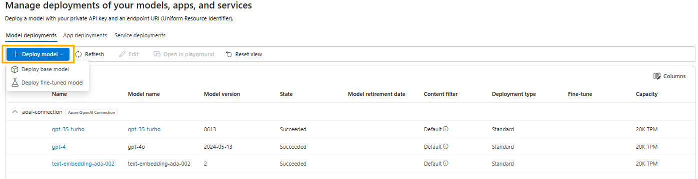
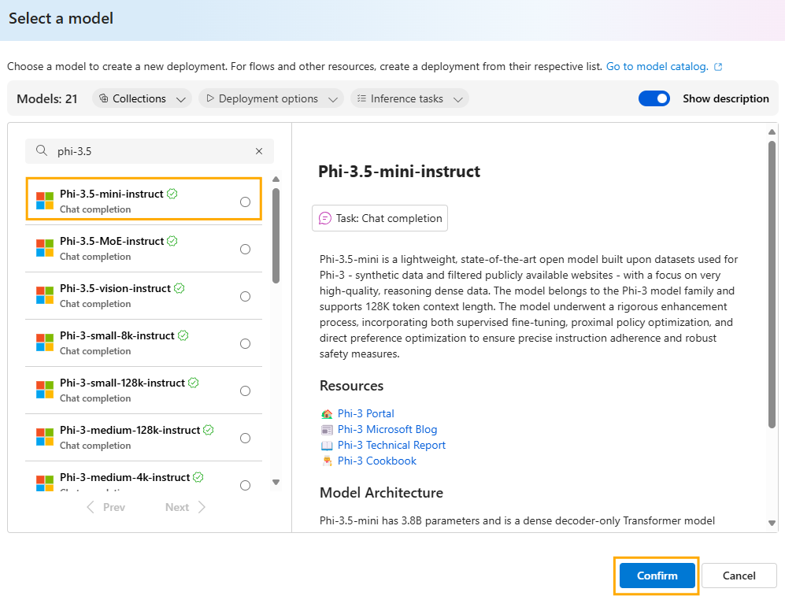
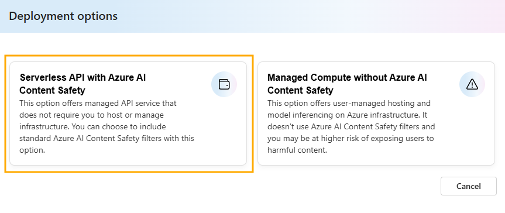
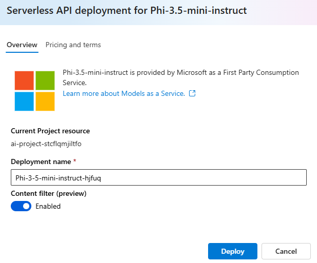
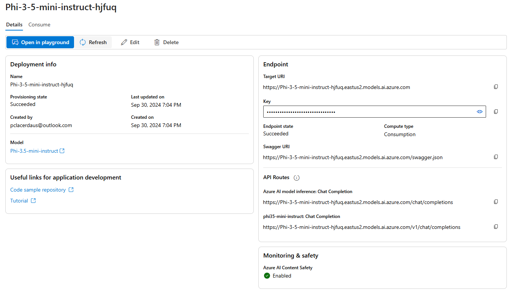
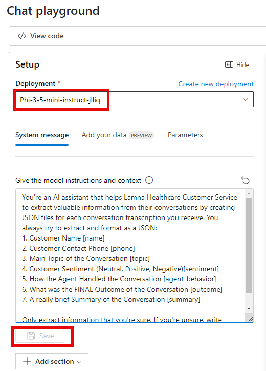
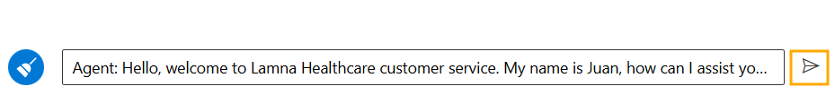
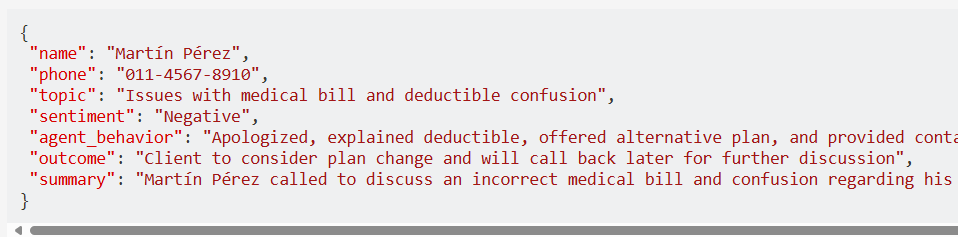

# Task 02 - Work with an Open Source LLM Model

## Introduction

Lamna Healthcare is interested in evaluating multiple models to determine which one best suits their needs. They require a solution that enables them to manually test multiple models quickly.

## Description

In this task, you will deploy an open-source model from the Azure AI Studio model catalog. You will repeat the conversation transcript JSON data extraction, summarization, and sentiment analysis that you performed in the previous task. This time, you will use the `Phi-3.5-mini` model to generate the JSON document instead of `gpt-4`.

The key tasks are as follows:

1. Using [Azure AI Studio](https://ai.azure.com), deploy the `Phi-3.5-mini` model from the catalog using Serverless API.

2. Test the model with a sample input payload based on your system message defined in the previous task.

## Success Criteria

* Consistently results in the LLM returning accurate and properly formatted JSON based on the provided conversation transcript using an open-source model.

## Solution

<details markdown="block">
<summary>Expand this section to view the solution</summary>

##### 1) Work with an Open Source LLM Model

In this step, you'll deploy an open-source Phi-3.5-mini model.

1. In [Azure AI Studio](https://ai.azure.com), ensure you are in the project you created in the previous task, and select **Deployments** from the left-hand menu.

2. Select **+ Create deployment**.
   
   

3. Search for and select the model **Phi-3.5-mini** then select **Confirm**.
   
   

4. Select the deployment option **Serverless API deployment**.
   
   

8. Click the **Deploy** button.

    
   
9. Creating the deployment will be quick since it is serverless.

   

10. Copy the following prompt and paste it into the system message field of the playground:

    ```text
    You're an AI assistant that helps Lamna Healthcare Customer Service to extract valuable information from their conversations by creating JSON files for each conversation transcription you receive. You always try to extract and format as a JSON:
    1. Customer Name [name]
    2. Customer Contact Phone [phone]
    3. Main Topic of the Conversation [topic]
    4. Customer Sentiment (Neutral, Positive, Negative)[sentiment]
    5. How the Agent Handled the Conversation [agent_behavior]
    6. What was the FINAL Outcome of the Conversation [outcome]
    7. A really brief Summary of the Conversation [summary]

    Only extract information that you're sure. If you're unsure, write "Unknown/Not Found" in the JSON file.
    ```

11. After copying, select **Apply changes**.

    

12. Copy following text and paste it into the chat session and press the send button:

```text
Agent: Hello, welcome to Lamna Healthcare customer service. My name is Juan, how can I assist you?
Client: Hello, Juan. I'm calling because I'm having issues with my medical bill I just received few days ago. It's incorrect and it does not match the numbers I was presented before my medical procedure.
Agent: I'm very sorry for the inconvenience, sir. Could you please tell me your phone number and your full name?
Client: Yes, sure. My number is 011-4567-8910 and my name is Martín Pérez.
Agent: Thank you, Mr. Pérez. I'm going to check your plan, you deduction limits and current year transactions towards your deductions. One moment, please.
Client: Okay, thank you.
Agent: Mr. Pérez, I've reviewed your plan and I see that you have the Silver basic plan of $3,000 deductable. Is that correct?
Client: Yes, that's correct.
Agent: Well, I would like to inform you that you have not met your deductible yet and $2,800 of the procedure will be still be your responsability and that will meet your deductible for the year.
Client: What? How is that possible? I paid over $2,000 already towards my deductable this year, I should only be $1,000 away from reaching my deductible not $2,800. 
Agent: I understand, Mr. Pérez. But keep in mind that not all fees your pay to doctors and labs and medications count towards your deductible. 
Client: Well, but they didn't explain that to me when I contracted the plan. They told me that everything I pay from my pocket towards doctors, specialists, labs and medications will count towards my deductable. I feel cheated.
Agent: I apologize, Mr. Pérez. It was not our intention to deceive you. If you think the deductable is too high, I recommed changing the plan to Gold at the next renewal window and that will bring the deductable to $1,000 for the new year.
Client: And how much would that cost me?
Agent: The plan rates will come out in November, you can call us back then or check the new rates online at that time.
Client: Mmm, I don't know. Isn't there another option? Can't you reduce the amount I have to pay for this bill as I was not explained how the deductible work correctly?
Agent: I'm sorry, Mr. Pérez. I don't have the power to change the bill or your deductible under the current Silver plan.
Client: Well, let me think about it. Can I call later to confirm?
Agent: Of course, Mr. Pérez. You can call whenever you want. The number is the same one you dialed now. Is there anything else I can help you with?
Client: No, that's all. Thank you for your attention.
Agent: Thank you, Mr. Pérez. Have a good day. Goodbye.
```



12. Observe the response generated by the Phi-3.5-mini model. You should see a result generated by the model in the command window.

    

</details>