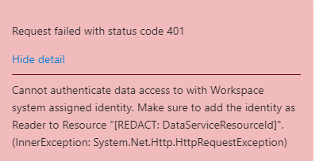

# Task 04 - Create, complete, and test a Prompt Flow

## Introduction

Lamna Healthcare has identified Prompt Flow as a powerful tool to assist in delivering AI solutions. Llamna Healthcare is interested in investigating Prompt Flow's visualized graph to create, customize, and orchestrate AI logic with an intuitive user interface.

## Description

In this task, you will create and execute a visual Prompt Flow within Azure AI Studio.

Key steps include:

1. Create a Prompt Flow in Azure AI Studio using the system message authored in the first Task.
2. Become familiar with the Prompt Flow editor and the Graph visualization.
3. Execute the flow within Azure AI Studio using the `GPT-4` model.
4. Verify the flow responds correctly to a conversation transcript.
5. **Remove the Llama 2 deployment to prevent incurring high costs.**

## Success Criteria

* Create a Prompt Flow in Azure AI Studio.
* Execute the flow within Azure AI Studio using the `GPT-4` model.
* Delete the Llama 2 deployment to prevent incurring high costs.

## Solution

<details markdown="block">
<summary>Expand this section to view the solution</summary>

##### 1) Create a Prompt Flow

Great, now that you have seen how you can deploy models, test them in the playground, and also seen a bit of how Content Safety works, let's see how you can create an orchestration flow for your LLM application in Prompt Flow.

1. In [Azure AI Studio](https://ai.azure.com), open the project that was created (if it's not already open) and return to the Chat Playground by selecting `Chat` from the left menu that is located beneath the **Project playground** heading.

2. In the **Chat playground** ensure the `gpt-4` model is selected in the **Deployment** drop down.

3. In the **System message** text field, add the following text. This is the same system message that was used earlier in the exercise. Select **Apply Changes** to save the system message.

    ```text
    You're an AI assistant that helps Lamna Healthcare Customer Service to extract valuable information from their conversations by creating JSON files for each conversation transcription you receive. You always try to extract and format as a JSON:
    1. Customer Name [name]
    2. Customer Contact Phone [phone]
    3. Main Topic of the Conversation [topic]
    4. Customer Sentiment (Neutral, Positive, Negative)[sentiment]
    5. How the Agent Handled the Conversation [agent_behavior]
    6. What was the FINAL Outcome of the Conversation [outcome]
    7. A really brief Summary of the Conversation [summary]

    Only extract information that you're sure. If you're unsure, write "Unknown/Not Found" in the JSON file.
    ```

    

4. Now that the system message is saved, select **Prompt flow** from the taskbar menu above the chat. A dialog will display asking about customization, leave the default settings and select **Open**.

5. In a few moments, the Prompt Flow editor will open. This is where you can create a flow that orchestrates the execution of multiple models and services.

6. To the right of the screen, observe the **Graph** section. This visualization displays the steps the flow will take to process the inputs and generate the outputs.

    

7. In the **Graph** section, select the **chat** node. This will highlight the associated **chat** node editor in the center of the screen. Ensure a **Connection** is selected.

8. Review the flow's configuration for api, deployment, prompt, and parameters like temperature and max_tokens. These values are model parameters that can be adjusted to customize the behavior of the model, or quickly test different configurations.

9. At the top of the flow editor (scroll to the top of the middle panel), there is an **Inputs** section, notice there are two inputs, **chat_history** and **question**. These are variables that are passed into the flow along with an individual chat completion request. If you look at the **Prompt** field in the **chat** node editor, you'll see how the variables are used in the prompt. The final rendered prompt is what gets sent into the large language model. This happens at each request because calls to the LLM are stateless.

10. To execute the flow within Azure AI Studio, you'll require a Runtime. To initiate it, select the **Start compute session** option from top taskbar menu.

    

11. In about a minute, the **Start compute session** button will change to a message indicating **Compute session running**. Select the **Chat** button next to this message to start interacting with the flow.

    

12. A **Chat** dialog displays. Copy and paste the following content into the chat box and press send (if you encounter a 404 error, please verify you selected a connection). This is the same conversation transcript that was used earlier in the exercise.

```text
Agent: Hello, welcome to Lamna Healthcare customer service. My name is Juan, how can I assist you?
Client: Hello, Juan. I'm calling because I'm having issues with my medical bill I just received few days ago. It's incorrect and it does not match the numbers I was presented before my medical procedure.
Agent: I'm very sorry for the inconvenience, sir. Could you please tell me your phone number and your full name?
Client: Yes, sure. My number is 011-4567-8910 and my name is Martín Pérez.
Agent: Thank you, Mr. Pérez. I'm going to check your plan, you deduction limits and current year transactions towards your deductions. One moment, please.
Client: Okay, thank you.
Agent: Mr. Pérez, I've reviewed your plan and I see that you have the Silver basic plan of $3,000 deductable. Is that correct?
Client: Yes, that's correct.
Agent: Well, I would like to inform you that you have not met your deductible yet and $2,800 of the procedure will be still be your responsability and that will meet your deductible for the year.
Client: What? How is that possible? I paid over $2,000 already towards my deductable this year, I should only be $1,000 away from reaching my deductible not $2,800. 
Agent: I understand, Mr. Pérez. But keep in mind that not all fees your pay to doctors and labs and medications count towards your deductible. 
Client: Well, but they didn't explain that to me when I contracted the plan. They told me that everything I pay from my pocket towards doctors, specialists, labs and medications will count towards my deductable. I feel cheated.
Agent: I apologize, Mr. Pérez. It was not our intention to deceive you. If you think the deductable is too high, I recommed changing the plan to Gold at the next renewal window and that will bring the deductable to $1,000 for the new year.
Client: And how much would that cost me?
Agent: The plan rates will come out in November, you can call us back then or check the new rates online at that time.
Client: Mmm, I don't know. Isn't there another option? Can't you reduce the amount I have to pay for this bill as I was not explained how the deductible work correctly?
Agent: I'm sorry, Mr. Pérez. I don't have the power to change the bill or your deductible under the current Silver plan.
Client: Well, let me think about it. Can I call later to confirm?
Agent: Of course, Mr. Pérez. You can call whenever you want. The number is the same one you dialed now. Is there anything else I can help you with?
Client: No, that's all. Thank you for your attention.
Agent: Thank you, Mr. Pérez. Have a good day. Goodbye.
```

13. Notice the chat results responds to the incoming transcript correctly.

    

> [!IMPORTANT]
> If you encounter an error like the one below, please add the `Reader` role to the `storage account` that is associated with the `Azure AI Studio` workspace.



14. To prevent incurring high costs, remove your Llama 2 deployment. This deployment is no longer necessary to complete the remaining labs. From the left menu in Azure AI Studio, select **Deployments**.

15. Select the **Llama 2** deployment from the list of deployed models.

16. From the top taskbar of the model deployment screen, select **Delete deployment**.

    

17. On the **Delete deployment** dialog, ensure the checkboxes for the deletion of the deployment and the deletion of the endpoint are checked. Select **Delete**.

    

18. Wait two minutes, then return to the **Deployments** model list. Select **Refresh** to verify the llama-2 deployment is no longer available or in the status **Deleting**.

</details>
