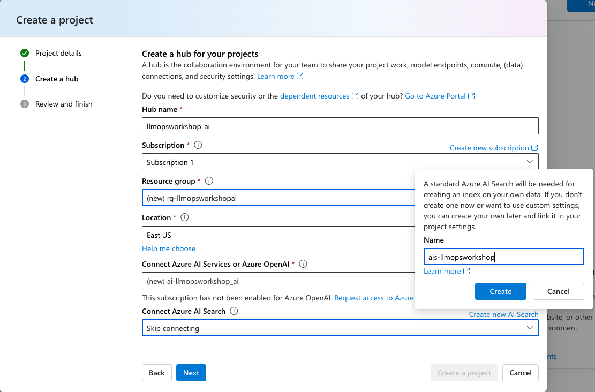
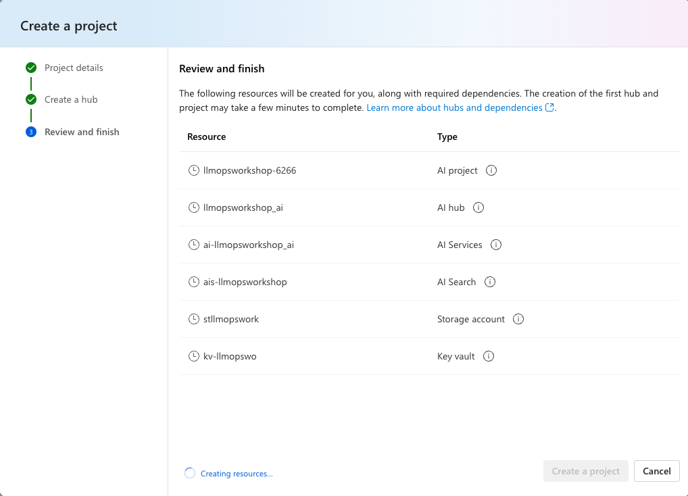
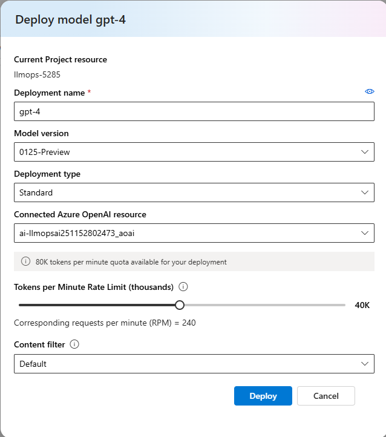
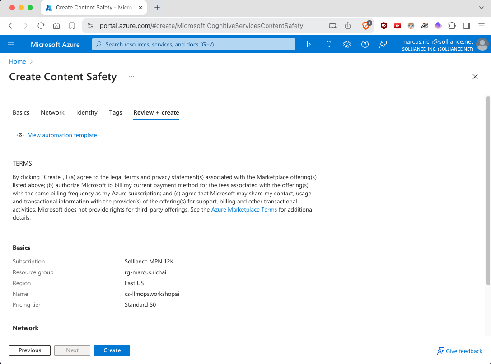

# Exercise 01 Setup - Use AzureAI Studio Playground and create an AI Project and establish AI Hub resources

## Description

In this task, you will setup and configure a Azure AI Studio project and define the system resources that will be used for the Hub.

## Success Criteria

* Setup Azure AI Studio and your first LLM

## Setup Steps

Expand this section to view the solution

##### 1) Create an AI Project and AI Hub Resouces

Let's start by creating a project in Azure AI Studio.

1. Go to your browser and type: https://ai.azure.com. After logging in with your Azure account, you will see the following screen:

2. Select **+ New project** to create a project.

3. Choose an unique name for your project.

4. Select the **Create a new hub** link and choose a name for your AI hub where your project resources will be created.

> Note: Choose the region where the GPT-4 models and text-embeddings-ada-002 are available.

5. Still on this screen, select the **Create a new Azure AI Search** option; this service will be used in the following lessons.

6. Finally, select Create a project for the creation of the resources to be used in your project.

##### 2) Deploy an Azure OpenAI model

After creating your AI Project, the first step is to create a deployment of an OpenAI model so you can start experimenting with the prompts you will use in your application.

1. To do this, select the **Deployments** option on the bottom of the project panel, and click on **Create deployment**.

2. From the list of models, select **gpt-4**.

3. On the next screen, define the name of the deployment, in this case, you can use the same name as the model and in the version field select the latest available version, in the example below we chose version **0125-Preview** (gpt4-turbo).

4. Click on **Advanced Options** and select at least 40K **Tokens per Minute Rate Limit*** to ensure the flows run smoothly in the upcoming lessons.

5. Now, just click on **Deploy** and your model deployment is created. You can now test it in the Playground.

##### 3) Create a Content Safety Service

1. By the end of this exercise, you will test with Content Safety. Therefore, click on the following link to create it [https://aka.ms/acs-create](https://aka.ms/acs-create). 

2. Select the resource group that you previously used for your AI Project. After that, follow the steps presented in the subsequent screens to continue with the creation process, start by clicking on **Review + create** button

3. Then click on **Create** to create your service.

4. Done! The Content Safety service is now created.

