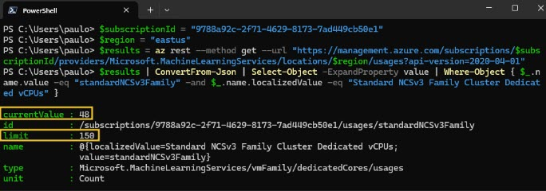
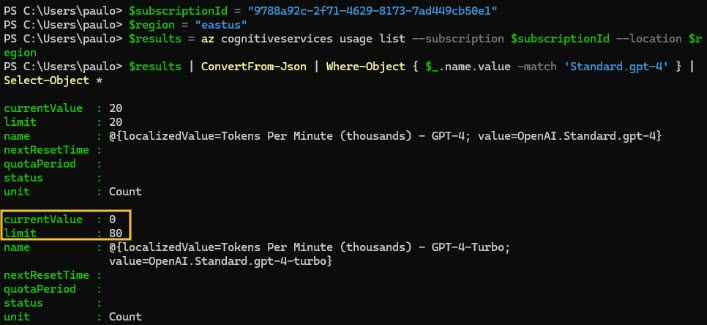

# Exercise 01 Setup - Use Azure AI Studio Playground and create an AI Project and establish AI Hub resources

## Description

In this setup task, you will setup and configure an Azure AI Studio project and deploy the underlying resources to support a centralized Azure AI Hub. Azure AI Hub is the main top-level resource in Azure AI Studio that enables governance, self-service, security and collaboration for AI projects.

## Success Criteria

* Prerequisites for Workshop
* Setup an Azure AI Studio project
* Deploy a Large Language Model (LLM)
* Deploy an Azure Content Safety service

## Prerequisites
<details markdown="block">
<summary>Expand this section to view the prerequisites</summary>

### Check if you have enough quota for the compute power needed to deploy Llama model in Exercise 1:
You will need 48 Standard_NC24s_v3 cores to deploy the Llama model. If you don't have enough quota, you can request an increase.

#### In Powershell run the following command:
```powershell
$subscriptionId = "replace by your subscription id" 
$region = "replace by the desired region" 
$results = az rest --method get --url "https://management.azure.com/subscriptions/$subscriptionId/providers/Microsoft.MachineLearningServices/locations/$region/usages?api-version=2020-04-01" 
$results | ConvertFrom-Json | Select-Object -ExpandProperty value | Where-Object { $_.name.value -eq "standardNCSv3Family" -and $_.name.localizedValue -eq "Standard NCSv3 Family Cluster Dedicated vCPUs" } 
```

#### Example of verification in EastUS region with 102 free cores



#### BASH equivalent

```bash
subscriptionId="replace by your subscription id" 
region="replace by the desired region" 
results=$(az rest --method get --url "https://management.azure.com/subscriptions/$subscriptionId/providers/Microsoft.MachineLearningServices/locations/$region/usages?api-version=2020-04-01") 
echo $results | jq -r '.value[] | select(.name.value == "standardNCSv3Family" and .name.localizedValue == "Standard NCSv3 Family Cluster Dedicated vCPUs")' 
```

> [!NOTE]
> Make sure to have jq installed to process the JSON output. You can install jq using the following command if needed: 

```powershell
sudo apt-get install jq
```

### Check if the chosen region has availability for the Azure OpenAI model that will be used in Exercise 1:
You will need 40k TPM of a GPT-4 model. If the region you want to use does not have availability, you can choose another region. You can run the following command in powershell to check how many GPT-4 TPMs do you have available in the desired region/sub. 

```powershell
$subscriptionId = "replace by your subscription id" 
$region = "replace by the desired region" 
$results = az cognitiveservices usage list --subscription $subscriptionId --location $region 
$results | ConvertFrom-Json | Where-Object { $_.name.value -match 'Standard.gpt-4' } | Select-Object * 
```
#### Example of verification in EastUS region with 80k TPMs free for GPT-4-Turbo



#### BASH equivalent

```bash
subscriptionId="replace by your subscription id" 
region="replace by the desired region" 
results=$(az cognitiveservices usage list --subscription $subscriptionId --location $region) 
echo $results | jq -r '.[] | select(.name.value | test("Standard.gpt-4"))' 
```

### Check if you have enough quota for the compute power that will be used to deploy the Prompt Flow in Exercise 3:

You will need 48 free cores of `Standard_DS3_v2` to deploy the prompt flow fow in Exercises 3 and 4. Run the following command in powershell: 
```powershell
$subscriptionId = "replace by your subscription id" 
$region = "replace by the desired region" 
$results = az rest --method get --url "https://management.azure.com/subscriptions/$subscriptionId/providers/Microsoft.MachineLearningServices/locations/$region/usages?api-version=2020-04-01" 
$results | ConvertFrom-Json | Select-Object -ExpandProperty value | Where-Object { $_.name.value -eq "standardDSv2Family" -and $_.name.localizedValue -eq "Standard DSv2 Family Cluster Dedicated vCPUs" } 
```
#### Bash equivalent: 
```bash
subscriptionId="replace by your subscription id" 
region="replace by the desired region" 
results=$(az rest --method get --url "https://management.azure.com/subscriptions/$subscriptionId/providers/Microsoft.MachineLearningServices/locations/$region/usages?api-version=2020-04-01") 
echo $results | jq -r '.value[] | select(.name.value == " standardDSv2Family " and .name.localizedValue == " Standard DSv2 Family Cluster Dedicated vCPUs ")' 
```
### Llama 2 deployment for Exercise 1:
Llama2 deployment takes approximately `15 minutes`, start the deployment in the setup phase so that when you reach the part of using the model it is already available. 

### Adding text-embeddings-ada-002 deployment to setup for Exercise 2:
In this setup early on, create text-embeddings-ada-002, it will be used in lab 2, but when created in lab 2 it can generate an error in the indexing process because in some cases it takes about 5 minutes to become active. You can wait till Exercise 2 to create it, but it is recommended to create it in this setup because of that 5 minutes possible delay.

### Content safety Permissions: 

Some attendees could see a problem openning the `Content Safety Studio`, unless they add the `Azure AI Developer role` to their user in the content safety resource, please add this role if you encounter the same problem.

</details>

## Setup Steps

<details markdown="block">
<summary>Expand this section to view the solution</summary>

##### 1) Create an AI Project and AI Hub Resouces

Let's start by creating a project in Azure AI Studio.

1. Go to your browser and type: [https://ai.azure.com](https://ai.azure.com). After logging in with your Azure account, you will see the following screen:

    

2. Select **+ New project** to create a project.

3. Choose an unique name for your project.

    

4. Above the **Hub** drop down box, select the **Create a new hub** link and choose a name for your AI hub where your project resources will be created.

    

    > Note: Choose the region where the GPT-4 models and text-embeddings-ada-002 are available.

5. Remaining on this screen, select the **Create a new Azure AI Search** link located above the **Connect Azure AI Search** drop down. Enter a name for the Azure AI Search resource, then choose **Create**.

    

6. Finally, review the details of the project, then select the **Create a project** button to deploy the project resources. Wait for the deployment to complete, this will take a minute or two.

    

    

##### 2) Deploy an Azure OpenAI model

After creating your AI Project, the first step is to create a deployment of an OpenAI model so you can start experimenting with the prompts you will use in your application.

1. To do this, select the **Deployments** option on the bottom of the project panel, and select the **+ Create deployment** button.

    

2. From the list of models, search for and select **gpt-4**.

    

3. In the **Deploy model** dialog window, define the name of the deployment, in this case, you can use the same name as the model and in the version field select the latest available version, in the example below we chose version **0125-Preview** (gpt4-turbo).

    

4. Select at least 40K **Tokens per Minute Rate Limit** to ensure the flows run smoothly in the upcoming lessons.

5. Select **Deploy** to deploy the **gpt-4** model. Once deployed, you can test it in the Playground.

##### 3) Create a Content Safety Service

This exercise involves the deployment of the Azure Content Safety service. This configurable service is used to detect and filter for inappropriate content ensuring that the content generated by the AI models is safe for the users.

1. Select the following link to create an [Azure Content Safety service](https://aka.ms/acs-create).

2. On the **Create Content Safety** screen in the **Basics** tab, select the resource group that was deployed when creating the AI Project in the first step. Provide a name for the service, and select **Standard S0** as the pricing tier. Select **Review + create** to continue.

    

3. On the **Review + create** tab, review the details of the service settings, then select **Create** to deploy the Azure Content Safety service.

    

4. Wait for the Content Safety service to be created. Once complete, you've successfully achieved the goals of this setup task.

    

</details>
