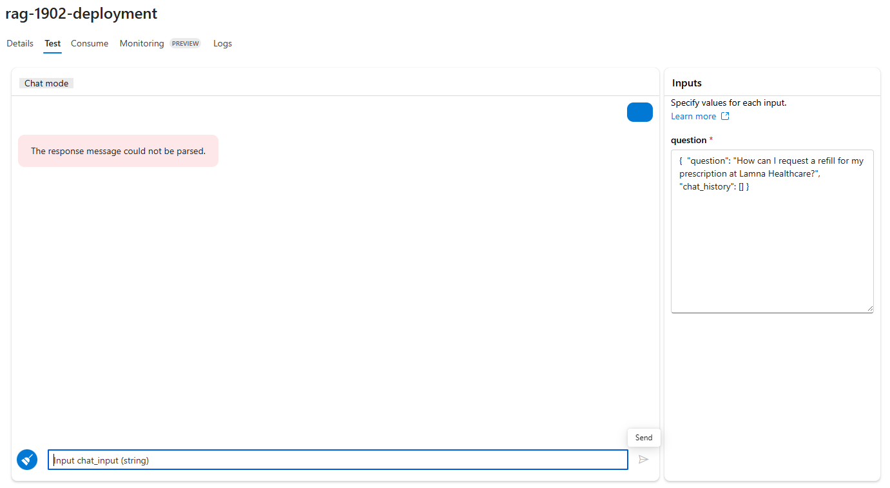

# Task 02 - Deploy the RAG flow to an online endpoint

## Description

In this task, you will use the included reference instructions to deploy the RAG flow to a managed endpoint

## Success Criteria

* Successfully deploy the RAG flow to a remote endpoint 
* Verify that the deployment completes successfully
* Verify you can Test the deployment by using the endpoint on the `Test` tab

<details markdown="block">

<summary>Expand this section to view the solution</summary>

### 1) Deploy the RAG flow to an online managed endpoint via SDK

In this task, you will deploy your application to a managed endpoint in Azure by building your flow Docker image, creating an online endpoint, and then creating a deployment in that endpoint. Finally, you will route all traffic to that deployment.

#### Step 1: Package your flow as a Docker image

First, you need to package your flow as a model. This process will create a Dockerfile for your flow.

1. Open a terminal in the root directory of your project.

2. Run the following command to build your flow and create a Docker image:

   ```bash
   pf flow build --source src --output dist --format docker
   ```

   This command packages your flow and outputs it in the `dist` directory in Docker format.

#### Step 2: Set the PYTHONPATH environment variable

To allow Python to find modules in the flow source directory, you need to set the `PYTHONPATH` environment variable.

1. In your terminal, run the following command:

   ```bash
   export PYTHONPATH=./src:$PYTHONPATH
   ```

> **Note:**
> Skipping this step will result in a `ModuleNotFoundError: No module named 'chat_request'`.

#### Step 3: Deploy your flow using the deployment script

Now you are ready to deploy your flow.

1. In the terminal, execute the following command:

   ```python
        python util/deploy_moe.py --endpoint-name rag-0000-endpoint --deployment-name rag-0000-deployment
   ```

  > **Important:**
  > The endpoint and deployment names must be unique within an Azure region. If you encounter an error indicating that the endpoint or deployment name already exists, try using different names. Note that this deployment process may take several minutes. 

  > **Note:**
  > If you receive the error "Key based authentication is not permitted on this storage account," enable the option **Allow storage account key access** in the **Configuration** section of your storage account in the Azure portal.

2. Once the deployment completes, you should see output similar to the following in your terminal:

   

#### Step 5: Review the deployment in Azure Machine Learning Studio

After the deployment is complete, you can review the results in Azure Machine Learning Studio.

1. Navigate to [Azure Machine Learning Studio](https://ml.azure.com/) and select your workspace.

2. In the left navigation pane, select **Endpoints**, then select **Managed Online Endpoints**.

3. You should see your new endpoint listed. Click on your endpoint to view its details.

   

#### Step 6: Test the deployed flow

1. In your endpoint's details page, select the **Test** tab.

2. Here, you can input test data to send to your deployed flow and see the responses.

#### Step 7: Consume the deployed flow

1. Select the **Consume** tab to see code samples that can be used to consume the deployed model in your application.

2. On this page, you can find the endpoint URL and the API key needed to call your endpoint.

3. You can use the REST endpoint directly or get started with one of the samples provided.

**Congratulations!** You have successfully deployed your flow to a managed endpoint. You can now integrate this endpoint into your applications or services, allowing you to leverage the power of your RAG (Retrieval-Augmented Generation) flow in a scalable and reliable manner.

</details>