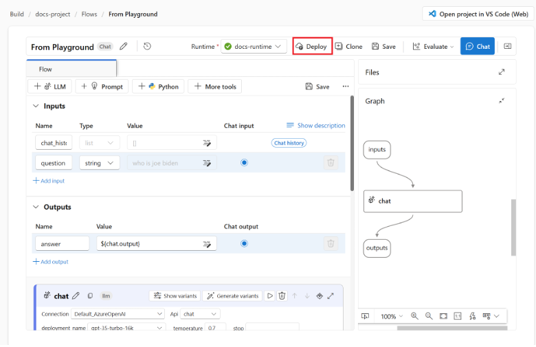
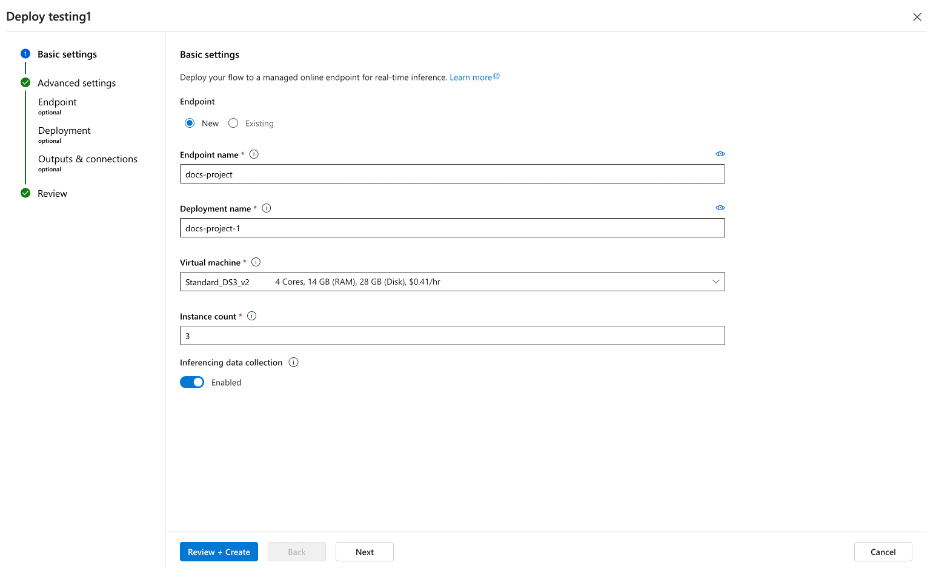
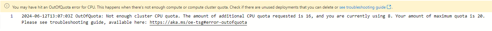
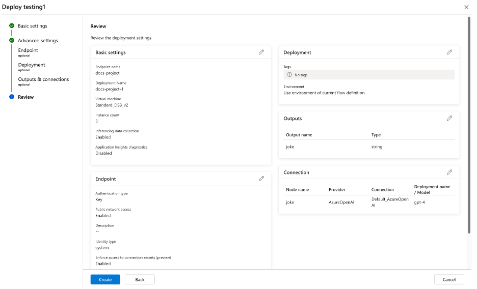
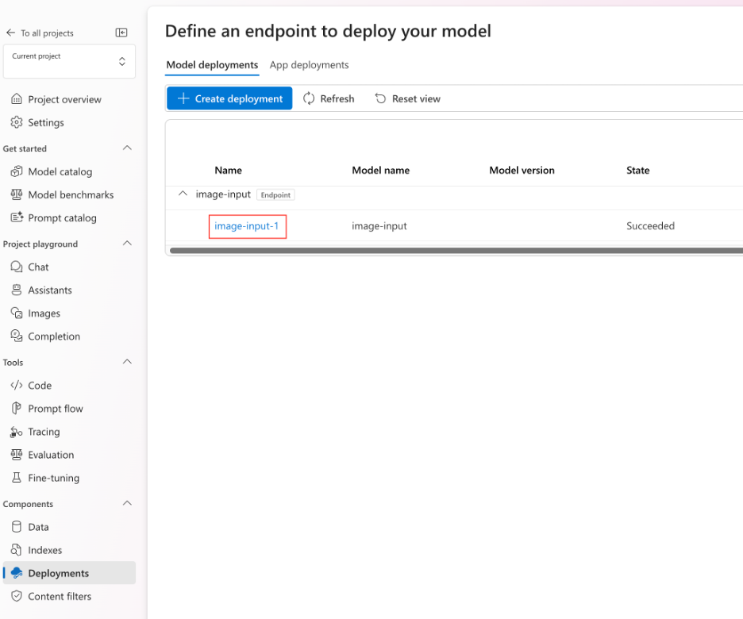
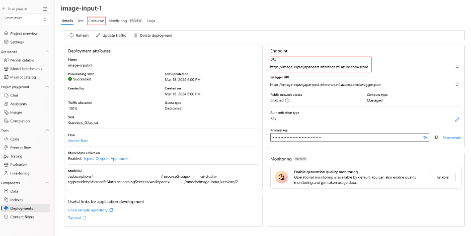
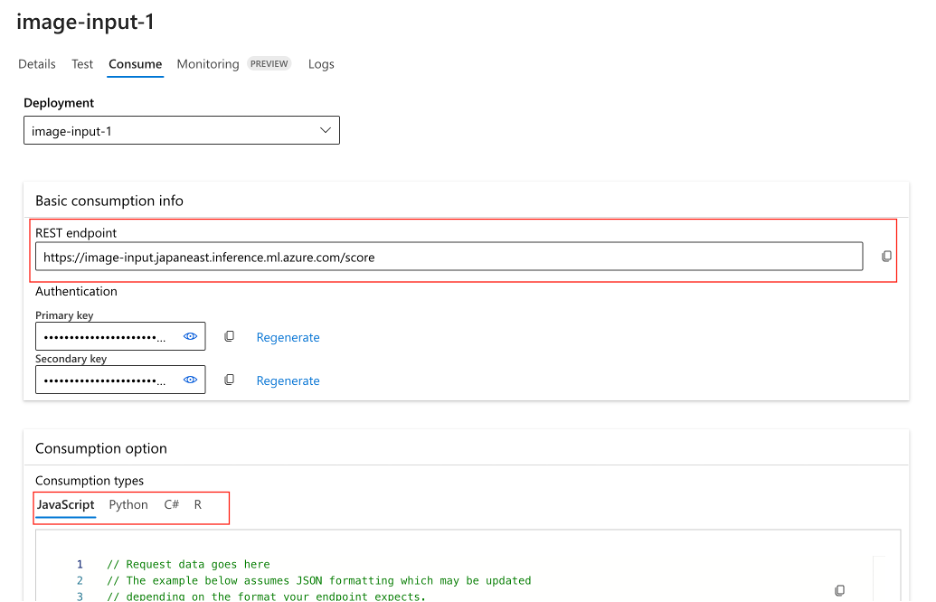

# Task 02 - Deploy the RAG flow to an online managed endpoint

## Description

In this task, you will use the included reference instructions to deploy the RAG flow to a managed endpoint

## Success Criteria

* Successfully deploy the RAG flow to a remote endpoint 

## Solution

Expand this section to view the solution

##### 1) Deploy the RAG flow to an online managed endpoint

Open the **Multi-Round Q&A on Your Data** flow that you created in the previous exercise.

After opening the flow, follow the instructions:

1.	Have a prompt flow ready for deployment. If you don't have one, see how to build a prompt flow.
   
2.	Optional: Select Chat to test if the flow is working correctly. Testing your flow before deployment is recommended best practice.
   
3.	Select Deploy on the flow editor.
   

4.	Provide the requested information on the Basic Settings page in the deployment wizard.
   

> [!IMPORTANT]
> If you receive an error like the one below stating "Out Of Quota - No enough cluster CPU quota", you can request a quota increaseor just reduce the `instance count` to 2 instead of 3 and try the deployment again.
> 

5.	Select Review + Create to review the settings and create the deployment. Otherwise you can select Next to proceed to the advanced settings pages.
    
6.	Select Create to deploy the prompt flow.
    

7.	To view the status of your deployment, select Deployments from the left navigation. Once the deployment is created successfully, you can select the deployment to view the details.
    

8.	Select the Consume tab to see code samples that can be used to consume the deployed model in your application.

9. On this page you can also see the endpoint URL that you can use to consume the endpoint.
    

10.	You can use the REST endpoint directly or get started with one of the samples shown here.
    

