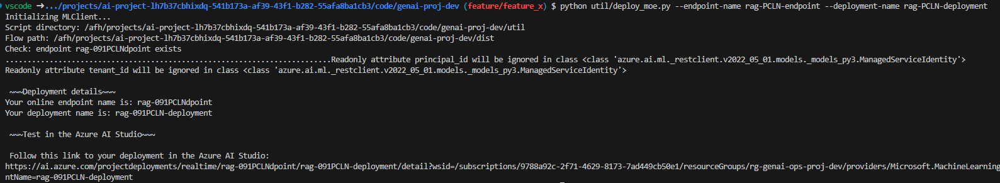
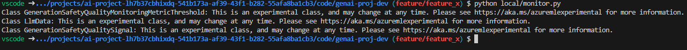
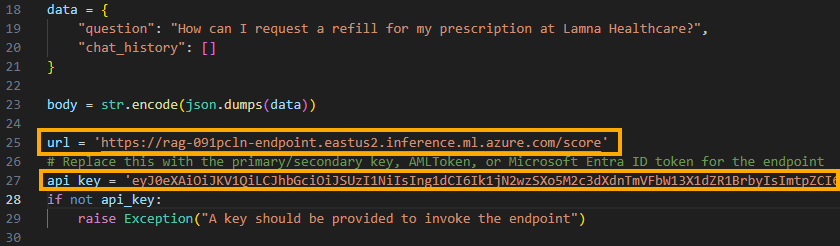
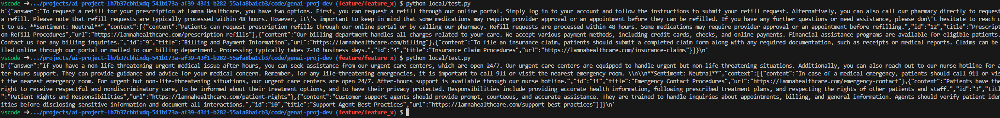
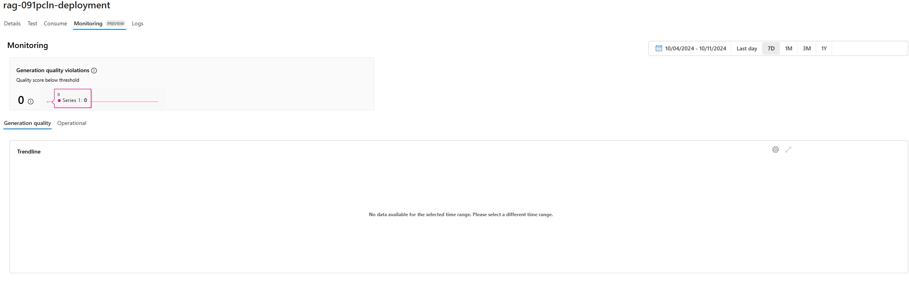
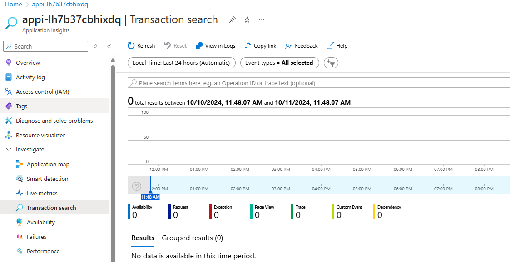

---

title: '01: Monitoring your Prompt Flows'
layout: default
nav_order: 1
parent: 'Exercise 04: Monitoring Prompt Flows'
---

# Task 01: Monitoring Your Prompt Flows

## Description

In this task, you will create and configure a monitoring solution to track the quality and token usage of your deployed prompt flow application.

## Success Criteria

- Set up monitoring for Prompt Flow
- Configure monitoring
- Consume monitoring results

## Solution

### 01: Deploy the RAG flow with tracing enabled

In this section, you will deploy your flow again, but this time with tracing enabled.

<details markdown="block">
<summary>Expand this section to view the solution</summary>

1. Delete the **dist** directory created during the previous deployment

   ```bash
   rm -rf dist
   ```

1. Package your flow as a Docker image. This process will create a Dockerfile for your flow.

   1. Open a terminal in the root directory of your project.

   1. Run the following command to build your flow and create a Docker image:

      ```bash
      pf flow build --source src --output dist --format docker
      ```

   This command packages your flow and outputs it to the **dist** directory in Docker format.

1. Enable tracing in your flow.

   1. Open the following file: **dist/flow/flow.flex.yaml**

   1. Update its content with:

      ```
      app_insights_enabled: true

      inputs:
        question:
          type: string
        chat_history:
          type: object
      entry: chat_request:get_response
      ```

   1. Save the file.

1. To ensure Python can locate the modules in the flow source directory, you need to set the **PYTHONPATH** environment variable. In your terminal, run the following command:

   ```bash
   export PYTHONPATH=./src:$PYTHONPATH
   ```

   {: .note }
   > Skipping this step will result in a **ModuleNotFoundError: No module named 'chat_request'**.

   Now, you're ready to deploy your flow.

1. Open the deployment script: **util/deploy_moe.py**

1. Navigate to line **77** and update it with the following code to configure your flow to work with the AI Studio Test Chat interface:

   ```python
        model = Model(
            name="ragwithtrace",
            path=flow_path,  # path to the promptflow folder
            properties=[  # enables the chat interface in the endpoint test tab
                ["azureml.promptflow.source_flow_id", "ragwithtrace"],
                ["azureml.promptflow.mode", "chat"],
                ["azureml.promptflow.chat_input", "question"],
                ["azureml.promptflow.chat_output", "answer"]
            ]
        ),
   ```

1. In the terminal, run the following command, replacing **XXXX** in both the **endpoint-name** and **deployment-name** with a unique four-digit number of your choice:

   ```bash
   python util/deploy_moe.py --endpoint-name rag-XXXX-endpoint --deployment-name rag-XXXX-deployment
   ```

   {: .important }
   > Use a different endpoint and deployment name than the one used in the previous exercise.

   {: .note }
   > This may take around 20 minutes to deploy.

1. Upon completion, you should see output similar to the following in your terminal:

   

   {: .note }
   > If you encounter the error "Key based authentication is not permitted on this storage account," enable the **Allow storage account key access** option in the **Configuration** section of your storage account in the Azure portal.

</details>

### 02: Create a monitor configuration

<details markdown="block">
<summary>Expand this section to view the solution</summary>

1. Create a **monitor.py** file in the **local** folder and add the following content, updating the **Update your Azure resources details** section with your deployment details:

   ```python
   from azure.ai.ml import MLClient
   from azure.ai.ml.entities import (
       MonitorSchedule,
       CronTrigger,
       MonitorDefinition,
       ServerlessSparkCompute,
       MonitoringTarget,
       AlertNotification,
       GenerationSafetyQualityMonitoringMetricThreshold,
       GenerationSafetyQualitySignal,
       BaselineDataRange,
       LlmData,
   )
   from azure.ai.ml.entities._inputs_outputs import Input
   from azure.ai.ml.constants import MonitorTargetTasks, MonitorDatasetContext
   from azure.identity import DefaultAzureCredential
   
   credential = DefaultAzureCredential()

   # Update your Azure resources details
   subscription_id = "[your_subscription_id]"
   resource_group = "[your_resource_group_id]"
   aoai_deployment_name = "gpt-4"
   aoai_connection_name = "aoai-connection"
   project_name = "[your_ai_studio_project_name]"  # Ex: ai-project-lh7b37cbhixdq
   endpoint_name = "[your_endpoint_name]"  # Ex: rag-PCLN-endpoint
   deployment_name = "[your_deployment_name]"  # Ex: rag-PCLN-deployment
   
   # These variables can be renamed, but it's not necessary
   app_trace_name = "app_traces"
   app_trace_version = "1"
   monitor_name = "gen_ai_monitor_generation_quality"
   defaultgsqsignalname = "gsq-signal"
   
   # Set the frequency and notification emails for the monitor
   trigger_schedule = CronTrigger(expression="*/5 * * * *")
   notification_emails_list = ["test@example.com", "def@example.com"]
   
   ml_client = MLClient(
       credential=credential,
       subscription_id=subscription_id,
       resource_group_name=resource_group,
       workspace_name=project_name,
   )
   
   spark_compute = ServerlessSparkCompute(instance_type="standard_e4s_v3", runtime_version="3.3")
   monitoring_target = MonitoringTarget(
       ml_task=MonitorTargetTasks.QUESTION_ANSWERING,
       endpoint_deployment_id=f"azureml:{endpoint_name}:{deployment_name}",
   )
   
   # Set thresholds (0.7 = 70%)
   aggregated_groundedness_pass_rate = 0.7
   aggregated_relevance_pass_rate = 0.7
   aggregated_coherence_pass_rate = 0.7
   aggregated_fluency_pass_rate = 0.7
   
   # Create a Generation Safety Quality (GSQ) signal
   generation_quality_thresholds = GenerationSafetyQualityMonitoringMetricThreshold(
       groundedness={"aggregated_groundedness_pass_rate": aggregated_groundedness_pass_rate},
       relevance={"aggregated_relevance_pass_rate": aggregated_relevance_pass_rate},
       coherence={"aggregated_coherence_pass_rate": aggregated_coherence_pass_rate},
       fluency={"aggregated_fluency_pass_rate": aggregated_fluency_pass_rate},
   )
   input_data = Input(
       type="uri_folder",
       path=f"{endpoint_name}-{deployment_name}-{app_trace_name}:{app_trace_version}",
   )
   data_window = BaselineDataRange(lookback_window_size="P7D", lookback_window_offset="P0D")
   production_data = LlmData(
       data_column_names={"prompt_column": "question", "completion_column": "answer", "context_column": "context"},
       input_data=input_data,
       data_window=data_window,
   )
   
   gsq_signal = GenerationSafetyQualitySignal(
       connection_id=f"/subscriptions/{subscription_id}/resourceGroups/{resource_group}/providers/Microsoft.MachineLearningServices/workspaces/{project_name}/connections/{aoai_connection_name}",
       metric_thresholds=generation_quality_thresholds,
       production_data=[production_data],
       sampling_rate=1.0,
       properties={
           "aoai_deployment_name": aoai_deployment_name,
           "enable_action_analyzer": "false",
           "azureml.modelmonitor.gsq_thresholds": '[{"metricName":"average_fluency","threshold":{"value":4}},{"metricName":"average_coherence","threshold":{"value":4}}]',
       },
   )
   
   monitoring_signals = {
       defaultgsqsignalname: gsq_signal,
   }
   
   monitor_settings = MonitorDefinition(
       compute=spark_compute,
       monitoring_target=monitoring_target,
       monitoring_signals=monitoring_signals,
       alert_notification=AlertNotification(emails=notification_emails_list),
   )
   
   model_monitor = MonitorSchedule(
       name=monitor_name,
       trigger=trigger_schedule,
       create_monitor=monitor_settings,
   )
   
   ml_client.schedules.begin_create_or_update(model_monitor)
   ```

1. Now, run the **monitor.py** program to create your monitor configuration:

   ```bash
   python local/monitor.py
   ```

   

Your monitoring configuration is now set up.

</details>

### 03: Send some requests to your endpoint to generate monitoring data

<details markdown="block">
<summary>Expand this section to view the solution</summary>

1. Update the **local/test.py** program created earlier with the new endpoint and API key

   

1. Save the file.

1. Run the **local/test.py** program multiple times to generate some requests

   ```bash
   python local/test.py
   ```

   

{: .note }
> You can vary the question content for each request by modifying it on line **19** of the **test.py** program.

</details>

### 04: Consume monitoring results

Once you've set up your monitor, it will run accordingly the schedule you set in the monitoring configuration.

<details markdown="block">
<summary>Expand this section to view the solution</summary>

1. Go to the **Monitoring (preview)** tab within the deployment to view the monitoring results.

1. Go to the **Generation quality** tab to monitor the quality of your application over time. Metrics shown include:

    - **Violation count**: Sum of violations for a given metric (e.g., Fluency) during the time window.
    - **Average score**: Average score for all instances (or requests) over the time window.

    The **Generation quality violations** card shows the **violation rate**, which is the number of violations divided by the total number of possible violations. Adjust thresholds and computation frequency (default: daily) in the settings.

   

1. Go to the **Operational** tab to view near real-time operational metrics for the deployment, including:

    - Request count
    - Latency
    - Error rate

   

[Reference](https://learn.microsoft.com/en-us/azure/ai-studio/how-to/monitor-quality-safety?tabs=azure-studio#advanced-monitoring-configuration-with-sdk-v2)

### 05: Enable tracing in Application Insights

You can enable tracing in Application Insights by selecting your workspace's Application Insights.

<details markdown="block">
<summary>Expand this section to view the solution</summary>

1. Open Application Insights, select **Usage and estimated costs** under **Configure** from the left menu.

1. Select **Custom metrics (Preview)**.

1. Select **With dimensions**, then select **OK** to save changes.

1. Select **Metrics** under **Monitoring** from the left menu.

1. Select **Promptflow standard metrics** from the Metric Namespace, and explore metrics using different aggregation methods.

1. Select **Transaction search** from the left menu to view tracing in the transactional data.

   

[Reference](https://learn.microsoft.com/en-us/azure/ai-studio/how-to/develop/trace-production-sdk)

</details>
