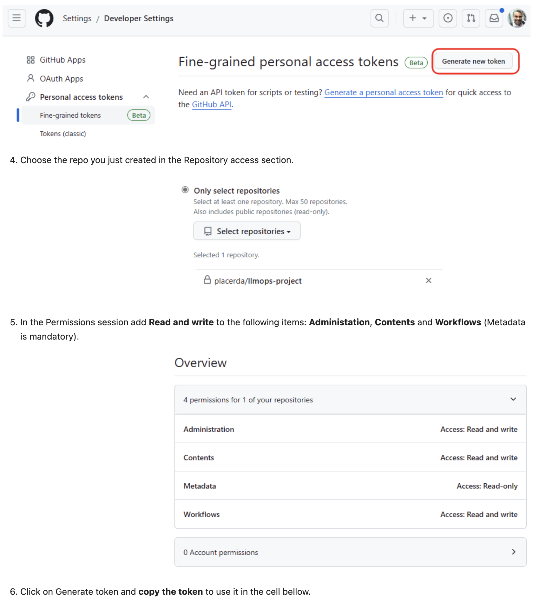
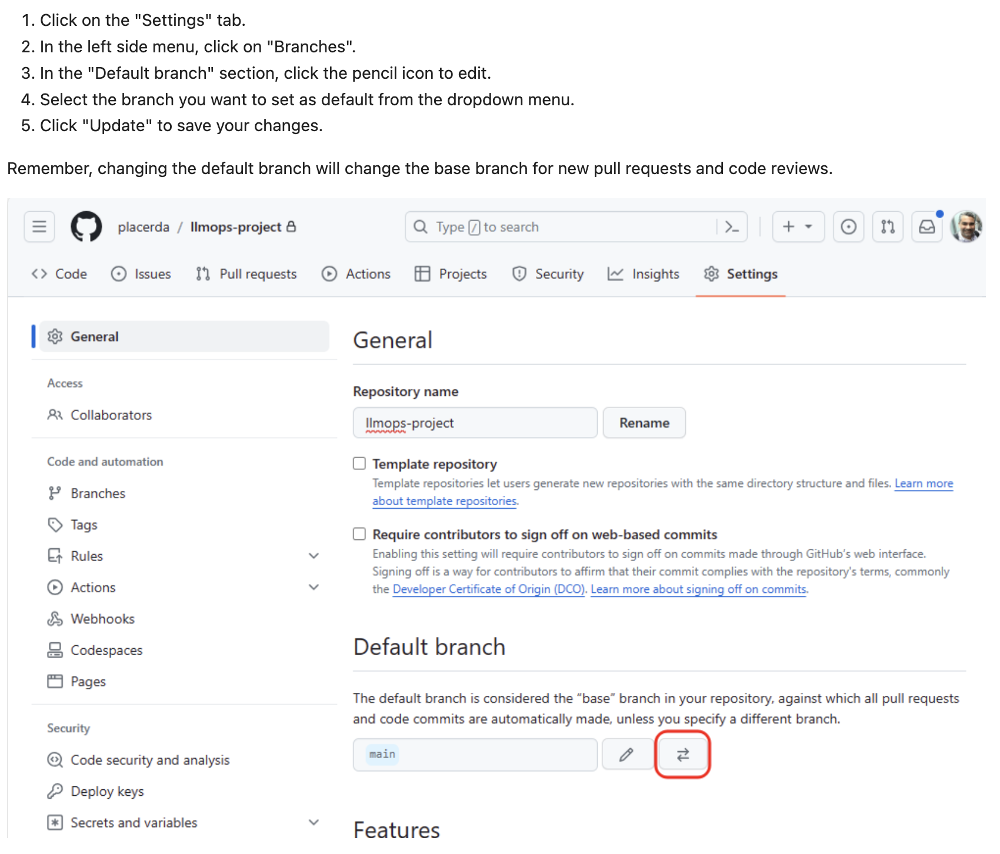

# Task 01 - Project Setup

## Description

In this exercise, we will learn how to setup **LLMOps with Prompt Flow** template to deploy an end-to-end LLMOps solution using **Prompt Flow** and **Github Actions**.

## Success Criteria

* Check and set up prerequisites
* Create a Service principal
* Setup a GitHub repository
* Create Azure OpenAI model deployment
* Update template configuration parameters

## References

* [LLMOps with Prompt Flow and GitHub](https://learn.microsoft.com/azure/machine-learning/prompt-flow/how-to-end-to-end-llmops-with-prompt-flow)
* [LLMOps with Prompt Flow template repo](https://github.com/microsoft/llmops-promptflow-template)
* [Basic LLMOps example](https://github.com/Azure/llmops-gha-demo/blob/main/docs/e2e_llmops_with_promptflow.md)

## Solution

<details markdown="block">
<summary>Expand this section to view the solution</summary>

##### 1) Check and set-up pre-requisites

Please ensure that you have the following resources in order to proceed with the hands-on steps:

* An Azure subscription.
* An Azure AI Project and AI Resource.
  * If you do not have an AI Project, please follow the instructions provided in this link to create one.
  * If this is your first AI project, create an AI Resource during the setup. Otherwise, utilize an existing one.
* A GitHub account.
* A workstation with the following options:
* Local machine or VM equipped with the following tools:
  * Git (usually pre-installed on most systems)
  * Python 3.10: Download Python
  * VS Code (Desktop version)
  * Azure CLI
  
> [!IMPORTANT]
> Since we will be utilizing bash commands, the operating system must be Windows with WSL, Linux, or MacOS.

##### 2) Check and set-up pre-requisites

1. Login to Azure so you can execute the commands for the following steps.

    ```bash
    az login
    ```

2. Create a Service Principle.

    An Azure service principal (SP) is a special type of identity that can be used by automated tools to access Azure resources.
    We will use a service principal to grant GitHub Actions the permission to use the resources in our Azure subscription.

    Run the following bash script after updating the `<subscription_id>` placeholder with your subscription id.

    Note: The service principal name will be automatically generated in the format: LLMOps-(seconds since epoch). If you prefer a different name, you can specify it in the `spname` variable.

    ```bash
    subscriptionId="<subscription_id>"
    
    spname="LLMOps-$(date +%s)"
    roleName="Owner"
    servicePrincipalName="Azure-ARM-${spname}"
    
    echo "Using subscription ID $subscriptionID"
    echo "> Setting subscription id"
    az account set --subscription $subscriptionId
    
    echo "Creating SP for RBAC with name $servicePrincipalName, with role $roleName and in scopes /subscriptions/$subscriptionId"
    az ad sp create-for-rbac --name $servicePrincipalName --role $roleName --scopes /subscriptions/$subscriptionId --sdk-auth
    
    echo "Please ensure that the information created here is properly saved for future use."
    ```

After executing the script, you will receive the following information regarding the service principal.


This is the information to be used for GitHub actions to authenticate in Azure.
**Save it in a secure place**, as you will need it later for GitHub configuration.

##### 3) Set up GitHub Repository

1. Go to GitHub and create a new repository

    

    Let's use **llmops-project** as the repo name for this workshop, if you chose a different repo name, you can replace llmops-project with the name you have chosen whenever you see it in the lab commands.

    

2. Create a GitHub personal access token

    Now you will create a Github personal access token to work with your repository from this notebook.

    Go to your GitHub account settings by clicking on your profile photo and then clicking on Settings and execute the following steps:

    

3. Populate your repo with the LLMOps project template

    Now you will populate your new repo with the LLMOps Prompt Flow Template Repo.

    In order to do that, run the following bash script, after update the `<github_org>` with your org name and `<github_pat>` with the token created above.

    ```bash
    github_org=<github_org>
    github_repo=llmops-project
    github_pat=<github_pat>
    
    echo "> Cloning your project repository"
    git clone https://${github_pat}@github.com/${github_org}/${github_repo}.git
    
    cd $github_repo
    
    echo "> Adding a new remote named 'original'"
    git remote add original https://github.com/microsoft/llmops-promptflow-template.git
    
    echo "> Fetching from 'original'"
    git fetch original main
    
    echo "> Merging with 'original/main'"
    git merge original/main
    
    echo "> Pushing to 'origin main'"
    git push origin main
    ```

4. Create a development branch and set it as default

    The project template assumes that the team utilizes the development branch as the primary source for coding and enhancing the prompt quality.

    Create a development branch by branching off from the main branch and designate it as the default branch to ensure that all pull requests are directed towards it.
    To generate the development branch and set it as the default in the **local repository**, execute the following bash cell.

    ```bash
    github_repo=llmops-project
    
    # Change directory to the cloned repository
    cd ${github_repo}
    
    echo "> Creating a development branch"
    git checkout -b development
    
    echo "> Pushing the development branch to the remote repository"
    git push origin development
    ```

    To make development branch as default in the GitHub remote repo, go to your GitHub repository on the web and execute the following steps:

    

5. Set up authentication with Azure and Github

    To start, go to the **Settings** tab of your GitHub project. Then, navigate to **Secrets and variables** followed by **Actions** and select **New repository secret**.

    

    Now, create a repository secret on GitHub called 'AZURE_CREDENTIALS' and provide the Azure Service Principal details you saved in step 2.1 as its content.

    

##### 4) Create Azure OpenAI model deployment

1. Create model deployment.

    The example flows in the LLMOps template utilize a deployment of the Azure OpenAI model called gpt-35-turbo.

    Please use Azure OpenAI Studio at https://ai.azure.com/ to create a deployment named gpt-35-turbo in the AI Project you set up during step 1 of this hands-on exercise.

    To do this, simply replicate what is shown in the next three images:

    

    

    

2. Update Azure OpenAI connection name

    LLMOps with Prompt flow project template example flows use an Azure OpenAI connection named `aoai`, in this hands on we will use AI Project's default Azure OpenAI connection.

    Run the next cell to update `flow.dag.yaml` for both standard and post-production-evaluation flows of the named_entity_recognition example to use the AI Project's default Azure OpenAI connection.

    The flow definition file for both named_entity_recognition standard and post-production-evolution flows can be found inside the template project folder in:

    * `named_entity_recognition\flows\standard\flow.dag.yaml`
    * `named_entity_recognition\flows\post-production-evaluation\flow.dag.yaml`

    ```python
    import fileinput
    import sys

    github_repo="llmops-project"

    def modify_file(filename):
        with fileinput.FileInput(filename, inplace=True) as file:
            for line in file:
                sys.stdout.write(line.replace('connection: aoai', 'connection: Default_AzureOpenAI'))

    filenames = [f'{github_repo}/named_entity_recognition/flows/standard/flow.dag.yaml',
                 f'{github_repo}/named_entity_recognition/flows/post-production-evaluation/flow.dag.yaml']

    list(map(modify_file, filenames))
    ```

##### 5) Update Template Configuration Parameters

The **LLMOps with Prompt Flow** template repo include three example use cases, we will focus on the **named_entity_recognition** one.
In this step, you will configure the name_entity_recognition flow's LLMOps and deployment parameters. After that we will be able
to create a pull request for this example.

1. Update flow's llmops parameters

    The file **llmops_config.json** contains information related to the resources and directories used in each environment.

    Navigate to the **named_entity_recognition** folder and open the **llmops_config.json** file, note that the parameters KEYVAULT_NAME, RESOURCE_GROUP_NAME, and WORKSPACE_NAME will be blank.

    Update them respectively with the name of the key vault, resource group, and AI project name created in step 1 of this lab.

    For simplicity, we will use the same resources for all environments.

    Example configuration:

    

2. Update flow's deployment parameters

    The file **deployment_config.json** contains information related to the solution deployment.

    Navigate to the **named_entity_recognition** folder and open the **configs/deployment_config.json** file.

    Update the ENDPOINT_NAME and CURRENT_DEPLOYMENT_NAME parameters.

    **deployment_config.json**

    Modify the configuration values in the deployment_config.json file in the azure_managed_endpoint section for the **dev** environment.

    During this lab we'll only use the dev environment, so no need to worry about the other environments.

    Example configuration:

    

3. Push updates to remote repo

To update the remote repository with the newly modified configurations, simply update the project repo name in **<github_repository>** and then push to the **development** branch by executing the next cell.

```bash
cd llmops-project
git add .
git commit -m "configuration update"
git push origin development
```

</details>
