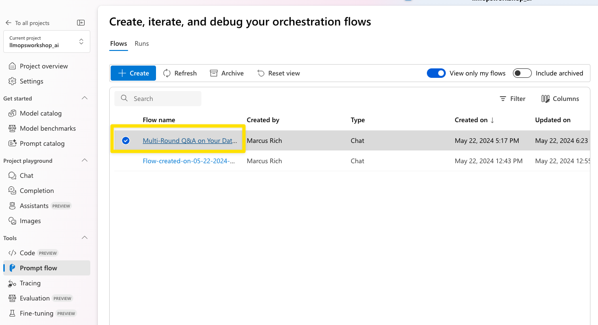
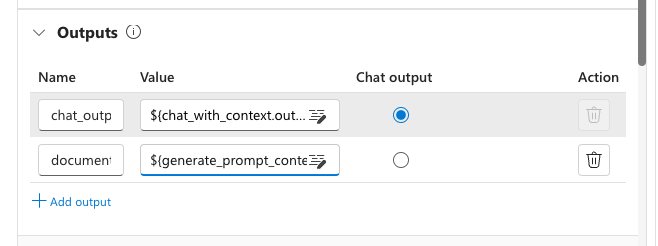
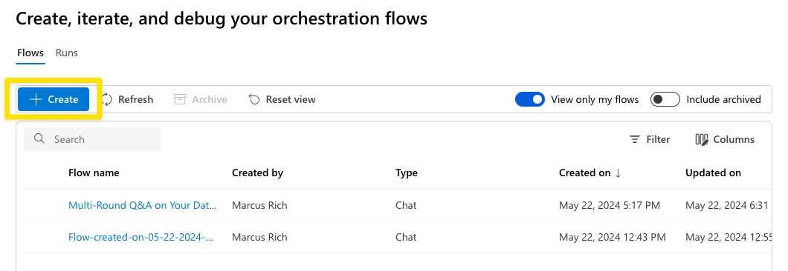
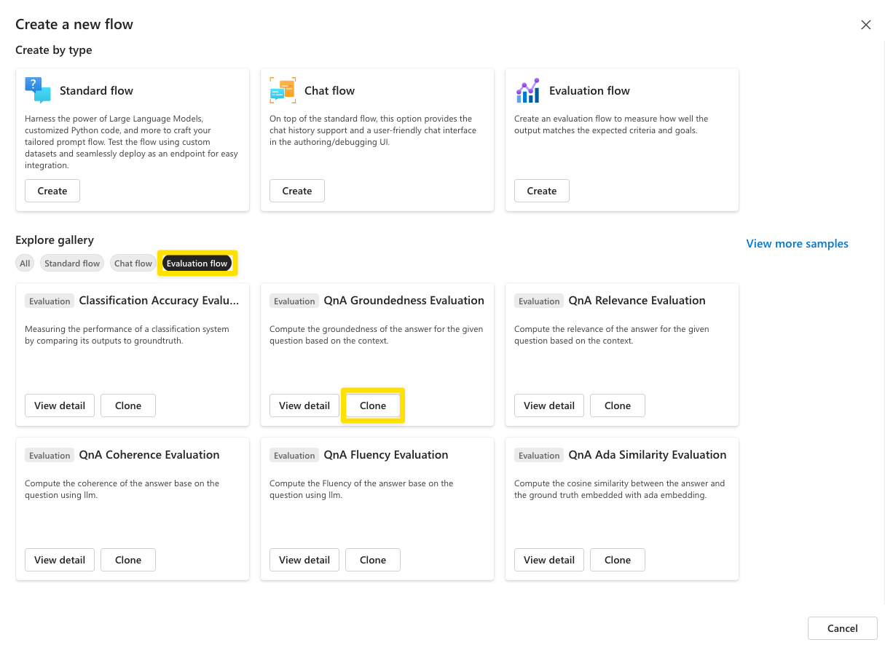
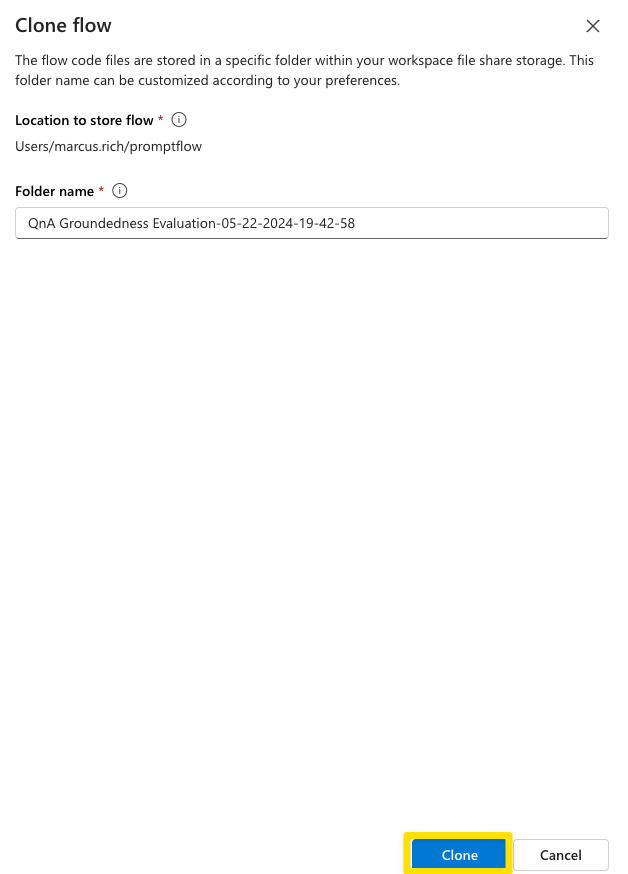
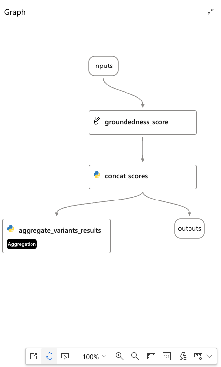
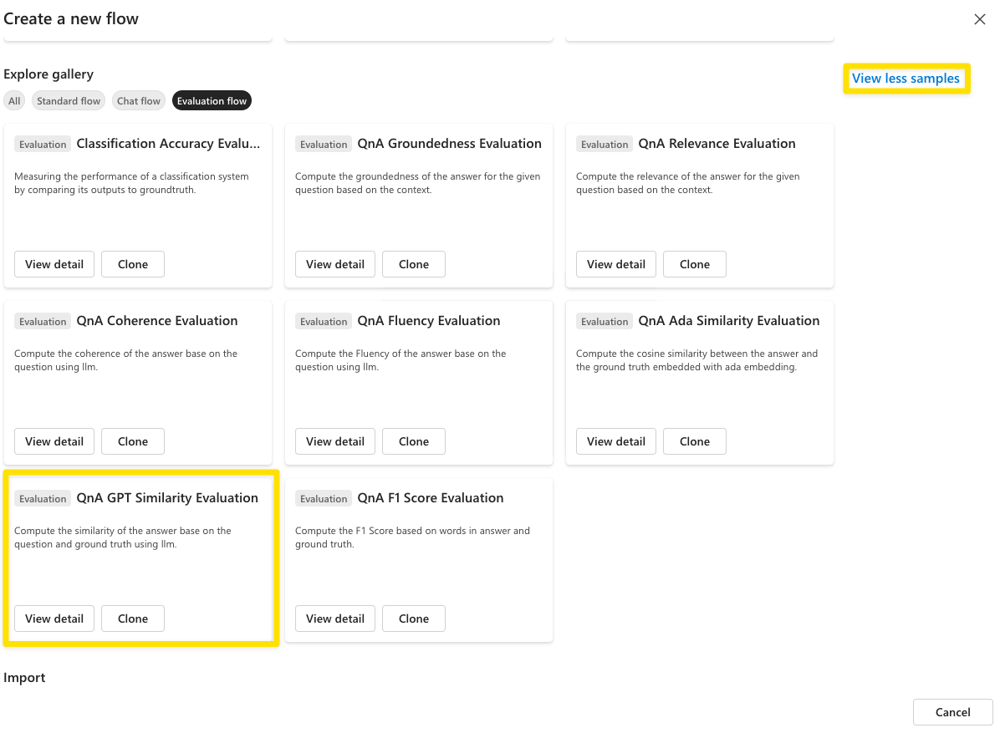
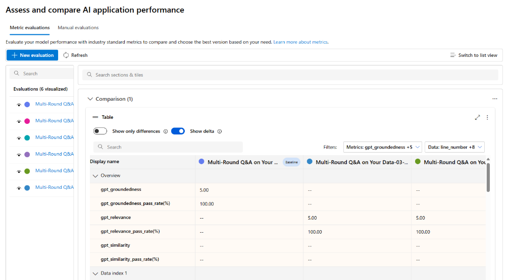
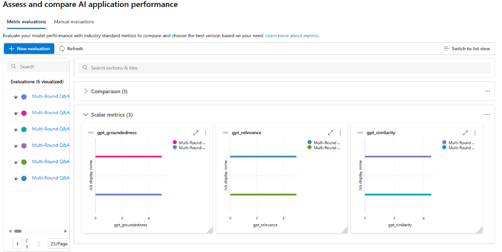

#### Evaluating and Deploying LLMs

#### Prerequisites

An Azure subscription where you can create an AI Hub Resource and a AI Search service.

#### Setup

If you are running this Lab after lesson 1, you don't need to worry about this step. Otherwise, follow **Setup** from **Lesson 1** to create a project and its associated resources in Azure AI Studio, as well as to deploy the GPT-4 model.

#### Lab Steps

In this Lab, you will execute the following steps:

1) Evaluate your Chat flow.

2) Deploy the RAG flow to an online managed endpoint.

##### 1) Evaluate your Chat flow

Go to your browser and type: https://ai.azure.com

Select the project created earlier and choose the **Prompt flow** item in the **Tools** section of the **Build** tab.

###### 1.1) Prepare you chat flow for evaluation

For the RAG flow that you created earlier to be evaluated, you must include additional information to the output node of this flow, specifically the context used to generate the answer.

This information will be used by the Evaluation Flow. To do this, just follow these steps:

In the Flows section of **Prompt Flow**, open the `Multi-Round Q&A on Your Data` flow that you created in the previous lab. This will be the flow we use for evaluation.

Create a new output named `documents` in the Outputs node. This output will represent the documents that were retrieved in the `lookup` node and subsequently formatted in the `generate_prompt_context` node.

Assign the output of the `generate_prompt_context` node to the `documents` output, as shown in the image below.

Click **Save** before moving to the next section.

###### 1.2) Create your evaluation flows

Still in the **Prompt flow** item in the **Tools** section of the **Build** tab, click on the blue **Create** button.

Select the **Evaluation Flow** filter and click on **Clone** on the **QnA Groundedness Evaluation** card.

Click on the other **Clone** button to create a copy of the flow.

A flow will be created with the following structure:

Update the `Connection` field to point to a gpt-4 deployment in `groundedness_score` node also update max_tokens to `1000` as shown in the next figure.  
   

After updating the connection information, click on **Save** in the evaluation flow and navigate to the Flows section in **Prompt Flow** item.

Now, you will repeat the same steps described so far in this **section 1.2** to create **two** additional evaluation flows, one `QnA Relevance Evaluation` and another `QnA GPT Similarity Evaluation`. The two images below show where these flows are in the prompt flow gallery.

> You will repeat **section 1.2** steps twice since you will need to create two additional evaluation flows.

> Note that the LLM nodes, where you will set the Azure OpenAI connection for each flow, have slightly different names: **relevance_score** and **similarity_score**, respectively.

QnA Relevance Evaluation:

QnA GPT Similarity Evaluation:

###### 1.3) Run the evaluation

In the Flows section of **Prompt Flow**, open the `Multi-Round Q&A on Your Data` flow that you created in the previous lab. This will be the flow we use for evaluation.

Start the automatic runtime by selecting **Start compute session**. The runtime will be useful for you to work with the flow moving forward.

Now select the **Custom evaluation** option in the Evaluate menu.

In the `Prompt_variants` option, select the option to run only **two variants** to avoid reaching your GPT-4 model quota limit, as shown in the example image below, click **Next**.

Select **Add new data**.

Upload the file data.csv inside the lesson_03 folder.

After clicking on **Add**  proceed to map the input fields as shown below: 

Select the three evaluation flows you just created.

Great job so far! Now, let's move on to the next step. Click on **Next** to set up the `question`, `context`, `ground_truth` and `answer` fields for each evaluation flow. You can see how to do this in the three images below.

> **Note:** Please take a moment to ensure you've selected the correct value. It's crucial for accurate metric calculation. Notice that the default values initially presented in the wizard are not the same as those indicated in the following images. Keep up the good work!

**QnA GPT Similarity Evaluation**

**QnA Groundedness Evaluation**

**QnA Relevance Evaluation**

Click on **Submit** to start the evaluation.

The evaluation process has started. To view all evaluations (one per variant), please navigate to the **Evaluation** section under the **Build** tab (If you see not started they are waiting on resources, they will say completed when finished).

Upon selecting specific evaluation results, you will have the ability to view their detailed information.

You can also select **Switch to dashboard view** to access a dashboard that provides a tabular and visual comparison between the rounds of different variations, as shown in the following images.

*Table comparison*

*Chart comparison*

##### 2) Deploy the RAG flow to an online managed endpoint

Open the **Multi-Round Q&A on Your Data** flow that you created in the previous lab.

After opening the flow, follow the instructions indicated in this link:

https://learn.microsoft.com/en-us/azure/ai-studio/how-to/flow-deploy